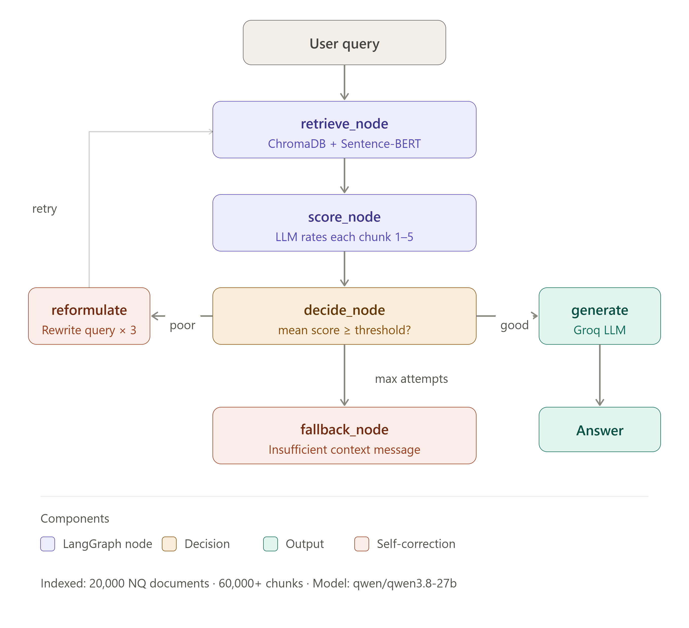

# RETRACE : Self Correcting RAG

A Retrieval-Augmented Generation system that detects when retrieval fails and automatically fixes itself instead of hallucinating an answer.


---

## The Problem

Standard RAG systems blindly trust whatever documents they retrieve. When the retrieved chunks don't actually contain the answer, the LLM still tries to answer and hallucinates. There's no mechanism to detect this failure or do anything about it.

```
User Query → Retrieve → Generate → Answer (even if wrong)
```

## The Solution

Instead of hoping retrieval works, this system checks and retries if it doesn't.

```
User Query → Retrieve → Score chunks → Good? → Generate → Answer
                                      ↓
                                    Poor? → Rewrite query → Retrieve again → Generate → Answer
                                                                           ↓
                                                                    Still poor? → "Insufficient context"
```

---

## Demo

<!-- Add your screen recording link here -->

---

## Results

Evaluated on 100 questions from the Natural Questions dataset:

| Metric | Baseline RAG | Self-Correcting RAG | Δ |
|---|---|---|---|
| Faithfulness | 0.900 | 0.845 | -6.1% |
| Answer Relevancy | 0.715 | 0.775 | **+8.4%** |
| Context Recall | 0.875 | 0.860 | -1.7% |

**Efficiency:**
- 3% of queries triggered self-correction
- Average latency: 7,490ms per query
- Model: qwen/qwen3.8-27b (Groq free tier)

---

## Architecture



### How It Works

When a question comes in, the system embeds it using `sentence-transformers/all-MiniLM-L6-v2` and searches 60,000+ indexed chunks in ChromaDB.

Before generating an answer, it scores each retrieved chunk 1-5 , asking the LLM "does this actually answer the question?" If the mean score is too low, it rewrites the query three ways (broader terms, synonyms, sub-questions), retrieves again for each rewrite, and picks whichever scored best.

If even the best rewrite doesn't produce useful context, it returns "I don't have enough information" instead of guessing.

The whole flow runs as a LangGraph state machine with 6 nodes:

```
retrieve_node → score_node → decide_node
                                  ↓
                    ┌─────────────┼──────────────┐
                    ↓             ↓              ↓
              generate_node  reformulate_node  fallback_node
                    ↓             ↓
                   END        retrieve_node (loop back)
```

---

## Tech Stack

| Component | Technology |
|---|---|
| LLM | Groq API — qwen/qwen3.8-27b |
| Embeddings | sentence-transformers/all-MiniLM-L6-v2 (local) |
| Vector DB | ChromaDB (persistent) |
| Orchestration | LangGraph |
| Dataset | Natural Questions (HuggingFace) — 20,000 docs |
| API Framework | FastAPI + Uvicorn |
| Authentication | API Key (X-API-Key header) |
| Document Parsing | pypdf, python-docx |
| UI | Gradio |
| Deployment | Docker |
| Testing | pytest (31 tests, all passing) |

---

## Project Structure

```
self-correcting-rag/
├── api/
│   ├── main.py                     ← FastAPI REST API (4 endpoints)
│   └── auth.py                     ← API key authentication
├── app/
│   ├── core/
│   │   ├── retriever.py            ← ChromaDB + Sentence-BERT search
│   │   ├── generator.py            ← Groq LLM answer generation
│   │   ├── scorer.py               ← LLM-based chunk quality scoring
│   │   ├── reformulator.py         ← Query rewriting engine
│   │   ├── pipeline.py             ← LangGraph state machine
│   │   ├── document_processor.py   ← PDF, Word, TXT parser
│   │   └── indexer.py              ← Multi-collection indexing
│   └── utils/
│       ├── config.py               ← Environment settings
│       └── logger.py               ← JSONL logging
├── evaluation/
│   ├── baseline_eval.py            ← Baseline RAG evaluation
│   ├── scrag_eval.py               ← Self-correcting RAG evaluation
│   └── results/
│       ├── baseline_scores.json
│       ├── scrag_scores.json
│       └── comparison.json
├── tests/
│   ├── test_retriever.py           ← 11 tests
│   ├── test_scorer.py              ← 11 tests
│   └── test_reformulator.py        ← 9 tests
├── ui/
│   └── gradio_app.py               ← Browser UI (Ask + Upload tabs)
├── data/
│   └── test_questions.json         ← 100 evaluation questions
├── assets/
│   └── architecture.png            ← Architecture diagram
├── Dockerfile
├── docker-compose.yml
├── requirements.txt                ← Full dependencies (dev + eval)
├── requirements-app.txt            ← Minimal dependencies (Docker)
└── README.md
```

---

## Quick Start

### Option 1 : Docker (Recommended)

```bash
git clone https://github.com/shrutidev18/self-correcting-rag.git
cd self-correcting-rag

cp .env.example .env
# Edit .env and add GROQ_API_KEY and API_KEY

docker compose up
```

Open `http://127.0.0.1:7860`

### Option 2 : Local

```bash
git clone https://github.com/shrutidev18/self-correcting-rag.git
cd self-correcting-rag
python -m venv venv
venv\Scripts\activate  # Windows
pip install -r requirements.txt

cp .env.example .env
# Edit .env and add GROQ_API_KEY and API_KEY

python data/download_beir.py  # first time only
python ui/gradio_app.py
```

### Run Tests

```bash
pytest tests/ -v
```

---

## Upload Your Own Documents

You can upload your own PDF, Word (.docx), or TXT files and ask questions against them.

### Via the UI

1. Open `http://127.0.0.1:7860`
2. Go to the **Upload Documents** tab
3. Upload your file and give your collection a name (e.g. `my_docs`)
4. Go to the **Ask** tab, select `my_docs` from the dropdown, and ask questions

### Via the API

```bash
# Upload a document
curl -X POST http://127.0.0.1:8000/upload \
  -H "X-API-Key: your_api_key_here" \
  -F "file=@yourfile.pdf" \
  -F "collection_name=my_docs"

# Ask a question against it
curl -X POST http://127.0.0.1:8000/ask \
  -H "X-API-Key: your_api_key_here" \
  -H "Content-Type: application/json" \
  -d '{"question": "What is this document about?", "collection_name": "my_docs"}'
```

Each user gets a private collection — completely isolated from the default dataset and other collections.

---

## REST API

```bash
uvicorn api.main:app --reload --port 8000
```

Interactive docs at `http://127.0.0.1:8000/docs`. Every request requires an `X-API-Key` header.

| Endpoint | Method | Description |
|---|---|---|
| `/ask` | POST | Ask a question, get self-correcting answer |
| `/upload` | POST | Upload and index a document |
| `/collections/{name}/documents` | GET | List documents in a collection |
| `/collections/{name}/documents/{doc_id}` | DELETE | Delete a document |

**Example response from `/ask`:**
```json
{
  "question": "What is DNS tunnelling?",
  "answer": "DNS tunnelling is a technique where malware abuses DNS as a communication channel...",
  "collection": "my_docs",
  "attempts": 1,
  "reformulated_query": "",
  "latency_ms": 1839.5,
  "retrieval_quality": "good",
  "mean_score": 2.8,
  "sources": ["sih_document_10e83cdc_chunk_3"]
}
```

---

## Get a Free Groq API Key

1. Go to [https://console.groq.com](https://console.groq.com)
2. Sign up for free
3. Create an API key
4. Add it to your `.env` file

---

## Key Findings

- Answer Relevancy improved by 8.4% with self-correction enabled
- The scorer works well for clear cases (score 5 or 1) but struggles with ambiguous chunks
- Reformulation helped most when the original query was too colloquial : e.g. "who sang go rest high on the mountain" → "original artist of Go Rest High on That Mountain"
- The system correctly refused to answer rather than hallucinate in all fallback cases

---

## Limitations

- Scorer adds latency (~2-5 seconds per query for 5 scoring calls)
- Daily token limit on Groq free tier limits large-scale evaluation
- The scorer sometimes gives harsh scores which can incorrectly flag good retrievals as poor a larger model would judge more consistently
- Self-correction only retries once multiple retries could improve recall further

---

## Built By

**Shruti Dev**
[LinkedIn](https://www.linkedin.com/in/shrutiidev) · [GitHub](https://github.com/shrutidev18)

---

## License

MIT
